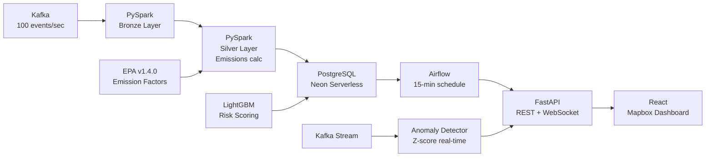

# Verdant

**Scope 3 Carbon Intelligence Platform**

Track carbon emissions across your supply chain — down to the
supplier, shipment, and SKU. Built with a production-grade
data pipeline, real-time anomaly detection, LightGBM risk
scoring, and a natural language query layer.

**[Live Demo](https://carbon-trace-8r4kifapt-nikhilgiridharans-projects.vercel.app)**
 · 
**[Medium Article](https://medium.com/@nickgiridharan)**


---

## Architecture



---

## What It Does

Verdant answers one question for supply chain teams:

> **Which suppliers are producing the most carbon, and what should we do about it?**

| Feature | Description |
|---|---|
| **Emissions pipeline** | Kafka → PySpark → PostgreSQL processing 10M+ shipment records |
| **EPA v1.4.0 factors** | Real emission factors from official EPA NAICS-6 dataset (Oct 2025) |
| **LightGBM risk scoring** | Classifies 500 suppliers as LOW/MEDIUM/HIGH/CRITICAL every 15 min |
| **Real-time anomaly detection** | Kafka consumer detects emissions spikes via z-score analysis |
| **Natural language queries** | Ask questions in plain English — Claude API converts to SQL |
| **Scenario engine** | Model transport mode switches and see CO₂ savings instantly |
| **PDF ESG report** | One-click downloadable Scope 3 disclosure report |
| **Live dashboard** | Interactive world map, Sankey attribution, 30/60/90d forecast |

---

## Stack

| Layer | Technology |
|---|---|
| Ingestion | Apache Kafka (MSK-compatible) |
| Processing | PySpark Structured Streaming |
| Storage | PostgreSQL (Neon serverless) |
| Orchestration | Apache Airflow |
| ML | LightGBM, scikit-learn, MLflow |
| API | FastAPI + WebSocket |
| Dashboard | React, Vite, Mapbox GL JS, Recharts |
| NL Query | Claude API (Anthropic) |
| Deployment | Neon + Render + Vercel ($0/month) |

---

## Data Sources

| Source | Description |
|---|---|
| [EPA v1.4.0](https://doi.org/10.5281/zenodo.17202747) | Supply Chain GHG Emission Factors, October 2025 |
| [US Census 2024](https://api.census.gov/data/timeseries/intltrade/imports) | International trade flow calibration |
| Synthetic shipments | 10M+ records calibrated to real trade patterns |

Emission factors sourced from EPA Supply Chain GHG Emission Factors v1.4.0
(Ingwersen and Young, 2025). GHG data year: 2023. Dollar year: 2024 USD.
GWP standard: IPCC AR6.

---

## Key Engineering Decisions

**Why Kafka over direct ingestion?**
Decouples producers from consumers — if Spark is slow, Kafka
buffers events. Also enables the real-time anomaly detection
consumer to read the same stream independently.

**Why not Snowflake/Redshift?**
The live deployment uses Neon (serverless PostgreSQL) to stay
within the $0/month budget. The pipeline is architected to
swap in Snowflake with a single dbt profile change.

**Why LightGBM over XGBoost?**
Native categorical support (country, transport mode) and
faster training on tabular data. Features include 30d/90d
emissions volume, transport mode mix, and carbon intensity.

**Real-time anomaly detection**
A dedicated Kafka consumer maintains a 30-event rolling window
per supplier and flags emissions spikes using z-score analysis
(threshold: 2.5σ). Alerts broadcast to dashboard via WebSocket
with sub-second latency.

---

## Local Development

### Prerequisites
- Docker + Docker Compose
- Python 3.11+
- Node.js 18+

### Quick Start

```bash
# Clone
git clone https://github.com/nikhilgiridharan/verdant.git
cd verdant

# Copy env vars
cp .env.example .env
# Fill in VITE_MAPBOX_TOKEN and DATABASE_URL

# Start full local stack (Kafka, Spark, Airflow, MLflow)
make up

# Seed the database
DATABASE_URL=<your_neon_url> python3 scripts/seed_neon.py

# Start dashboard
cd dashboard && npm install && npm run dev
```

### Environment Variables

| Variable | Description |
|---|---|
| `DATABASE_URL` | Neon PostgreSQL connection string |
| `VITE_API_BASE_URL` | FastAPI backend URL |
| `VITE_MAPBOX_TOKEN` | Mapbox GL JS public token |
| `ANTHROPIC_API_KEY` | Claude API key for NL queries |
| `RESEND_API_KEY` | Resend API key for email digest |

See `.env.production.example` for full reference.

## Project Structure
